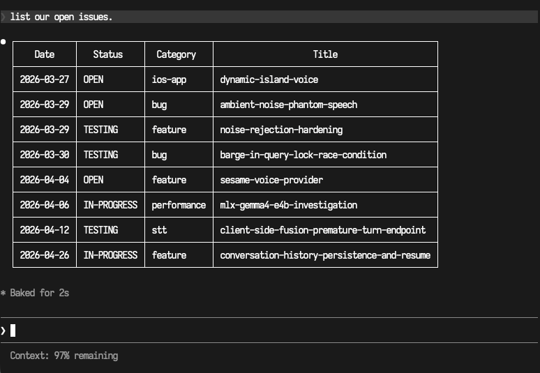

# flatissues

A file-based issue tracker for [Claude Code](https://claude.com/claude-code) projects — and a convention that changes how Claude collaborates with you on engineering work.

## Why use it

Conversation context is volatile. Bugs found during a long session, decisions made during research, follow-ups noted in passing — none of it sticks around unless something writes it down. flatissues writes it down: one file per issue in your repo, status in the filename, history in the body, all tracked by git. New Claude sessions can read `INDEX.md` and pick up where the last one left off.

What you get on top of a normal tracker:

**You don't manage the tracker — Claude does.** Filenames, status renames, index regeneration, archiving. You stay in plain English: *"file an issue for the dropdown bug"*, *"mark the auth refactor resolved"*, *"what's still open?"*. Claude handles the file ops correctly because the rule file teaches them.

**Multi-session work has a real handoff.** Tasks too large for one Claude instance can be planned as sprints from the start. Each sprint runs in a fresh Claude session with a clean context; the previous sprint writes a one-line prompt you paste to start the next one. No "where were we?" rediscovery.

**Claude proactively suggests filing issues** at moments most setups would drop them: when a bug surfaces mid-task, when scope creeps, after a research synthesis, before a refactor begins. It asks before creating — never autonomously files.



*A real Claude Code session listing the open issues for a project tracked with flatissues. Claude reads the filenames directly — no commands, no API.*

## Install

Ask Claude to install flatissues. Then start a fresh conversation — Claude Code auto-loads the convention and plain-language commands work directly.

Prefer to run it yourself? `npx flatissues init` in your project root.

## How it works

Issues are markdown files in `issues/`, named `YYYY-MM-DD_STATUS_category_short-slug.md`. Status changes are `git mv` (the filename is the source of truth, every change is a normal commit). An auto-generated `INDEX.md` lists everything by status. The tracker is ~470 lines of Node, zero dependencies.

The Claude-side protocol lives in `.claude/rules/flatissues.md`, which Claude Code auto-loads on launch. It teaches the naming convention, the suggest-don't-autonomously-file rule, and the sprint workflow.

<details>
<summary><b>What an issue file looks like</b></summary>

Every issue starts as a copy of this template, then gets filled in as the work progresses. The Sprint Execution Plan section is optional — only used when the work is too large for a single Claude session.

````markdown
# Issue Title Here

## Metadata
- **Date**: YYYY-MM-DD
- **Status**: OPEN
- **Category**: feature | bug | performance | infra | docs | refactor | research

## Problem
What's happening, what should be happening, and why this matters.

## Investigation Notes
- What was checked
- What was discovered
- Relevant file/line references

## Proposed Solution
What to do, and roughly how big the change is.

## Sprint Execution Plan
*Delete this section if the work is small enough for a single Claude instance.
Otherwise, fill it in before starting work — see issues/README.md § Sprint Workflow.*

### Sprint 1 — [name]
- **Scope:** [layers/phases]
- **Key files:** [paths to read first]
- **Deliverables:** [what should exist when this sprint is done]
- **Kickoff prompt:**
  ```
  Read issues/<this-file> — implement Sprint 1. Follow the sprint process
  in issues/README.md. Start by reading the files listed under Sprint 1.
  ```

### Sprint 2 — [name]
- **Scope:** ...
- **Key files:** ...
- **Deliverables:** ...
- **Kickoff prompt:** *(written by Sprint 1's instance during handoff)*

## Resolution
*Filled in once resolved.*

## Status History
- YYYY-MM-DD — OPEN, initial report
````

</details>

## Configuration & CLI

See `issues/config.json` (statuses, categories, project name) and `npx flatissues help` for CLI flags, including `--inline` (append to `CLAUDE.md` instead of writing `.claude/rules/`).

## License

MIT.
